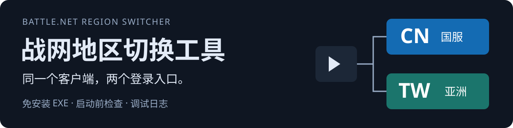
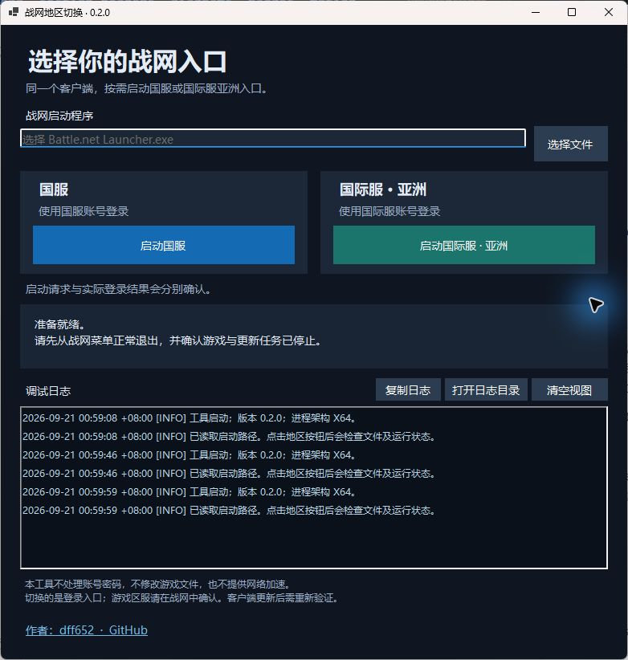

<p align="center">
  
</p>

# BattleNetRegionSwitcher

**把战网国服和国际服亚洲的启动入口，放进一个免安装的 Windows 工具。** 选择地区前检查运行状态；遇到问题，直接查看窗口里的调试日志。

[](https://github.com/dff652/BattleNetRegionSwitcher/actions/workflows/build.yml)
**Windows 11 x64 · v0.2.0 · 自带 .NET · 作者 [dff652](https://github.com/dff652)**

[获取便携版](#获取便携版) · [开始使用](#开始使用) · [日志与排错](#日志与排错) · [兼容与边界](#兼容与边界) · [反馈问题](https://github.com/dff652/BattleNetRegionSwitcher/issues)

项目文档：[便携版使用说明](./docs/PORTABLE.md) · [验证记录](./docs/VALIDATION.md) · [进展与后续任务](./docs/STATUS.md) · [更新记录](./CHANGELOG.md)

## 看看界面

<p align="center">
  
</p>

界面截图来自实际运行的 v0.2.0，未选择启动路径。工具可以自动查找常见安装位置，也支持手动选择战网程序。

| 功能 | 实际行为 |
| --- | --- |
| 两个登录入口 | 通过固定地区参数，启动已有的同一套战网 |
| 启动前检查 | 战网、Agent、常见游戏或临时更新进程仍运行时，阻止重复启动 |
| 现场查看日志 | 显示时间、检查结果与失败原因，支持复制和打开日志目录 |

## 获取便携版

目前通过 **GitHub Actions 构建产物** 提供下载，尚未发布 GitHub Release：

1. 登录 GitHub，打开 [Windows 构建页面](https://github.com/dff652/BattleNetRegionSwitcher/actions/workflows/build.yml)。
2. 选择最近一次成功的运行，在 **Artifacts** 中下载 `BattleNetRegionSwitcher-win-x64`。
3. 解压 ZIP，双击 `BattleNetRegionSwitcher.exe`。不需要安装器、管理员权限或另装 .NET；包内附有可离线阅读的 `使用说明.md`。

构建产物保留 **14 天**；过期后需等待新构建，或由维护者手动触发。源码下载包不包含可运行 EXE。

**可以把便携 ZIP 发给其他人。** 对方仍需要 Windows 11 x64、已安装的战网、对应地区账号和可用网络；路径无法自动识别时需手动选择。其他电脑和完整游戏流程尚未全面验证。

> 这是免安装便携版，不是零残留程序：工具会在 `%LOCALAPPDATA%\BattleNetRegionSwitcher` 保存设置和日志，单文件运行时也可能解压内置组件。当前 EXE 未做代码签名，Windows 可能显示来源提示。

## 开始使用

1. **正常退出游戏与战网。** 如有更新任务，先等待完成或通过战网自身的退出确认暂停。
2. **准备网络。** 如需加速，先自行配置已有加速器；本工具不管理 VPN、代理或路由。
3. **确认启动程序。** 自动识别失败时，选择 `Battle.net Launcher.exe` 或 `Battle.net.exe`。
4. **选择“启动国服”或“启动国际服 · 亚洲”。** 在战网中确认入口并使用对应账号登录。

启动按钮发出的只是启动请求。账号是否登录成功、具体游戏选择哪个区服，仍以战网和游戏页面为准。

## 日志与排错

日志面板显示工具自身的 `INFO / WARN / ERROR` 信息。**复制日志**方便反馈，**打开日志目录**便于查找文件，**清空视图**只清空窗口显示，不删除磁盘日志。

| 遇到的情况 | 下一步 |
| --- | --- |
| 提示战网或游戏正在运行 | 从对应程序正常退出，再重试 |
| 只剩 Agent 正在运行 | 等待后台更新代理结束；工具不会强杀它 |
| 找不到启动程序 | 用“选择文件”定位战网安装目录里的 EXE |
| 登录成功，但新闻或商城加载失败 | 对比“在浏览器中打开”的结果，并单独检查网络或加速范围 |

提交 [Issue](https://github.com/dff652/BattleNetRegionSwitcher/issues) 时，可附工具版本、战网版本、复现步骤和相关日志；不要附账号密码、验证码或战网原始配置。

<details>
<summary>本机保存了哪些数据？</summary>

全部位于 `%LOCALAPPDATA%\BattleNetRegionSwitcher`：

- `settings.json`：启动路径和上次请求地区。
- `debug.log`：工具诊断记录，约 256 KiB 后轮转为 `debug.previous.log`；界面保留最近约 300 行。

日志不自动上传，不采集战网原始日志、账号、密码、验证码、登录令牌或好友列表，不记录完整安装路径；异常仅记录类型。复制日志会写入系统剪贴板。设置与日志均不纳入源码仓库。

</details>

## 兼容与边界

- **当前是初步验证版。** 本机 Windows 11 x64 已完成界面和重复启动阻止检查；12 项核心隔离测试通过。战网 2.52.12.17821 的国际服登录已有成功记录，完整“国际服 → 国服 → 国际服”及游戏验收仍待完成。详见 [验证记录](./docs/VALIDATION.md)。
- **切换的是客户端登录入口。** 不迁移账号、角色、余额或购买内容，也不替你选择每款游戏的区服。
- **参数不是已确认的官方稳定接口。** 客户端更新后需要重新验证；检查名单也不能覆盖所有游戏进程。
- **不强杀、不代登录。** 工具不直接修改战网配置、语言或游戏文件，不保存凭据、不提供网络加速。战网自身可能记住最后一次地区选择。

## 原理与编译

工具使用 C# + WinForms，通过独立参数启动程序，不拼接任意命令。正常退出战网后，也可以直接使用两个快捷方式，无需本工具：

```text
"C:\Program Files (x86)\Battle.net\Battle.net Launcher.exe" --setregion=CN
"C:\Program Files (x86)\Battle.net\Battle.net Launcher.exe" --setregion=TW
```

本次实测中 TW 启动后的配置值为 `KR`，这不是具体游戏已选择韩国或台湾服务器的证明。

<details>
<summary>从源码构建 Windows x64 便携版</summary>

在 Windows 上安装 .NET 10 SDK（`global.json` 记录版本 10.0.401），进入项目目录：

```powershell
./scripts/build.ps1 -Publish
```

SDK 没有加入 PATH 时：

```powershell
./scripts/build.ps1 -DotnetPath '实际SDK目录\dotnet.exe' -Publish
```

脚本依次编译、执行隔离测试、生成自包含 EXE。发布目录为 `artifacts/win-x64/`，源码与运行包分开存放。

[GitHub Actions 工作流](./.github/workflows/build.yml) 在推送 main、提交 PR 或手动触发后执行同样的构建；它不访问用户的战网，也不自动创建 GitHub Release。

</details>

---

由 [dff652](https://github.com/dff652) 维护 · [源码](https://github.com/dff652/BattleNetRegionSwitcher) · [构建下载](https://github.com/dff652/BattleNetRegionSwitcher/actions/workflows/build.yml) · [问题反馈](https://github.com/dff652/BattleNetRegionSwitcher/issues)

非暴雪官方工具，与暴雪娱乐无隶属关系。
